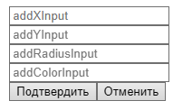
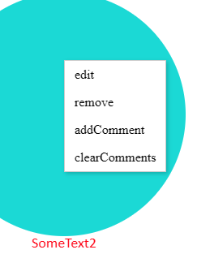
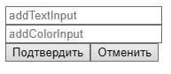
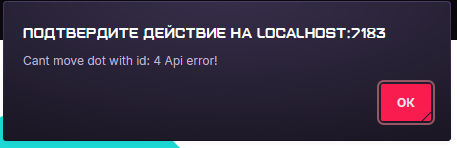
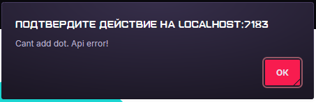

# Тестовое задание Лебедев

### Описание Backend:
* Program.cs - стартовая точка работы бэкенда программы.
* appsettings.json - хранит стоку подключения к БД и иные конфигурационные данные.
#### Директория api:
Состоит из файлов:
##### Comments.cs: - REST API для работы с комментариями
##### Dots.cs: - REST API для работы с точками

#### Директория db:
Состоит из файлов:
* DB.cs: - Содержит класс DB для работы с БД и начальные тестовые данные.
* Tables.cs: - Содержит классы Dot и Comment, содержафие описание структуры соответствующих таблиц в БД.

### Описание Frontend:
#### Директория wwwroot:
Состоит из файлов:
* konva.js: - локальная версия библиотеки Konva.js
* jquery-3.7.1.min.js: - локальная версия библиотеки JQuery.

* Client.js: - корневой файл реализуемого функционала фронтенда ля тестового задания, используемый файлом index.html.

* KonvaUI.js: - содержит классы CommentsUI и DotsUI, реализующие работу с отрисовкой объектов на канвасе. Оба класса реализуют паттерн проектирования Синглтон.

* APICalls.js: - содержит классы DotsApiCalls и CommentsApiCalls, состоящих из набора статических методов для взаимодействия с api.

* ContextUI.js: - содержит функционал для создания пользовательских элементов интерфейса не являющимися объектами для отрисовки на канвасе.(формы и контекстные меню). Состоит из классов: 
  * ContextMenu - класс для создания контекстных меню.  
  * ContextForm - класс для создания форм для ввода данных. 
  * ContextUIDots - класс для создания форм для работы с точками. 
  * ContextUIComments - класс для создания форм для работы с комментариями.  
  * ContextElements - класс для очистки форм и контекстных меню.

Callbacks.js: - содержит 2 класса DotsCallbacks и CommentsCallbacks хранящие статические методы для использования в колбеках. реализуют совместное использование методов отрисовки объектов из KonvaUI.js и ajax запросов к api из APICalls.js. Также содержит класс CanvasLoader, используемый для начальной отрисовки объектов исходя из данных полученых от api.

### Инструкция по использованию:
Нажатие по канвасу по пустому пространству открывает форму.\

Нажатие на точку открывает контекстное меню точки.\

Форма добавления комментария.\

Двойной клик по точке удаляет точку.

Если при отсутствии доступа к серверу и/или некорректных данных в форме выходит ошибка api.

Попытка передвинуть точку когда сервер отключен:

Попытка добавить точку введя неполные/некорректные данные формы:

### Ограничения для полей ввода и значений таблиц на бэкенде:
* Поля "X", "Y", "Radius" - должны являться целыми числами.
* Поля "текста" - не должны являтся пустыми строками
* Поля "цвета" - должны состоять ровно из 6 символов каждый из которых должен являться целым числом от 0 до 9 включительно или символом английских букв "a", "b", "c", "d", "e", "f". (цвет хранится и используется в формате "hex" без начального знака "#")
При несоблюдении данных ограничений сервер вернет 400 код ошибки и не выполнит запрашиваемую операцию с БД.

